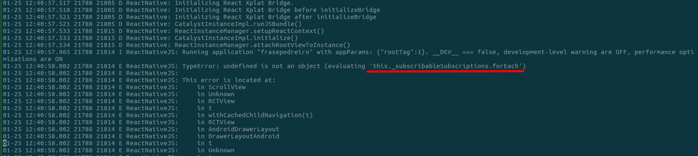
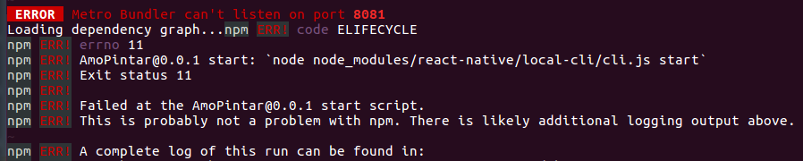

## How to build for Android without development server
```
$ react-native bundle --dev false --platform android --entry-file index.android.js --bundle-output ./android/app/build/intermediates/assets/debug/index.android.bundle --assets-dest ./android/app/build/intermediates/res/merged/debug
$ cd android
$ ./gradlew assembleDebug
```

## utf8 is not a function


I got this error when I building project without development server, the command which I exatcly executed is:
`react-native bundle --dev false --platform android --entry-file index.android.js --bundle-output ./android/app/build/intermediates/assets/debug/index.android.bundle --assets-dest ./android/app/build/intermediates/res/merged/debug`

This problem is fixed updating Node version.

## How to install Gradle Daemon
Following the [link of tutorial to install Gradle Daemon](https://docs.gradle.org/2.14.1/userguide/gradle_daemon.html)

Basically is is add a new configuration to the file `«USER_HOME»/.gradle/gradle.properties`, if it's not exist, you can just create it.

Add this lie to the file:
```
org.gradle.daemon=true
```

## Ambiguous resolution of react-native

I got this issue because I had `node_modules2` that was my backup, I just remove it and remove all the cache and all done.

[This post](https://github.com/facebook/react-native/issues/15789) also give me a lot of idea about how to fix it.

## this._subscribableSubscriptions.forEach



Resolved in [react-native issue](https://github.com/facebook/react-native/issues/17348).

## How to change android versionNamber and versionName

Google Play is not allow developers to upload the same version of application, so is necessary change version of your app to publish new release.

To upadate version is necessary to change `versionCode` and `versionName` in `android/app/build.gradle` like:
```
android {

    defaultConfig {

        versionCode 1
        versionName "1.0"

        {...}
    }

    {...}
}
```
[reference](https://stackoverflow.com/questions/35924721/how-to-update-version-number-of-react-native-app)

## How to include decorator to use
Some decorators could be very helpfull to development, like `autobind`, to use decorators in React Native is necessary to install `babel-plugin-transform-decorators-legacy`:
```
$ npm install --save-dev babel-plugin-transform-decorators-legacy
```

Then include it to babel plugin list, edit `<projectRoot>/.babelrc` file:
```
{
   "presets": ["react-native"],
+  "plugins": ["transform-decorators-legacy"]
}
```

Now your React Native project is supporting decorators.
One of awesome decorator package that I use is [core-decorators](https://www.npmjs.com/package/core-decorators), it's including a lot of usuful decorators.

## Metro Bundler can't listen on port 8081
This issue is because is there some application is already using port 8081.

### How to fix

Find which process id (probably is another instance of `npm start`) and kill it:

```
// get process id by
$ netstat -tulpn | grep :8081

// kill process by id
$ kill <your process id>
```



