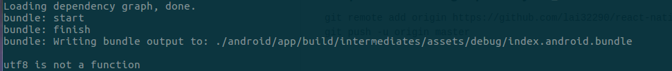

## How to build for Android without development server
```
$ react-native bundle --dev false --platform android --entry-file index.android.js --bundle-output ./android/app/build/intermediates/assets/debug/index.android.bundle --assets-dest ./android/app/build/intermediates/res/merged/debug
$ cd android
$ ./gradlew assembleDebug
```

## utf8 is not a function


I got this error when I building project without development server, the command which I exatcly executed is:
`react-native bundle --dev false --platform android --entry-file index.android.js --bundle-output ./android/app/build/intermediates/assets/debug/index.android.bundle --assets-dest ./android/app/build/intermediates/res/merged/debug`

This problem is fixed updating Node version.
